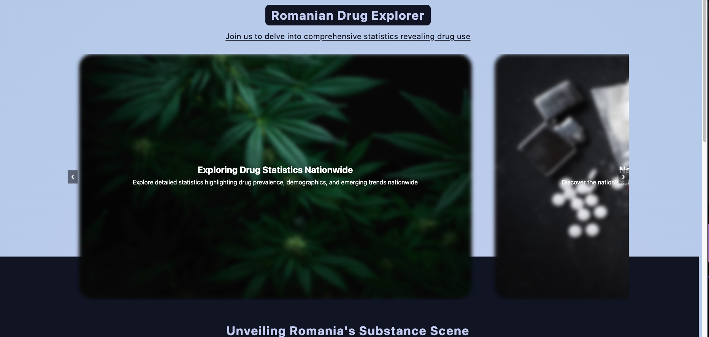
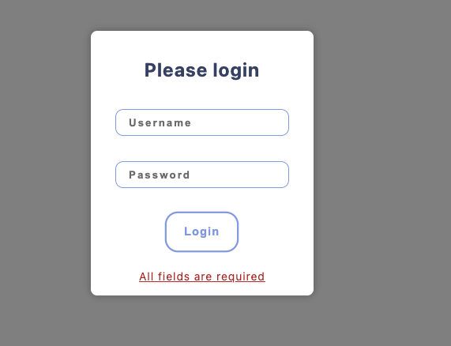
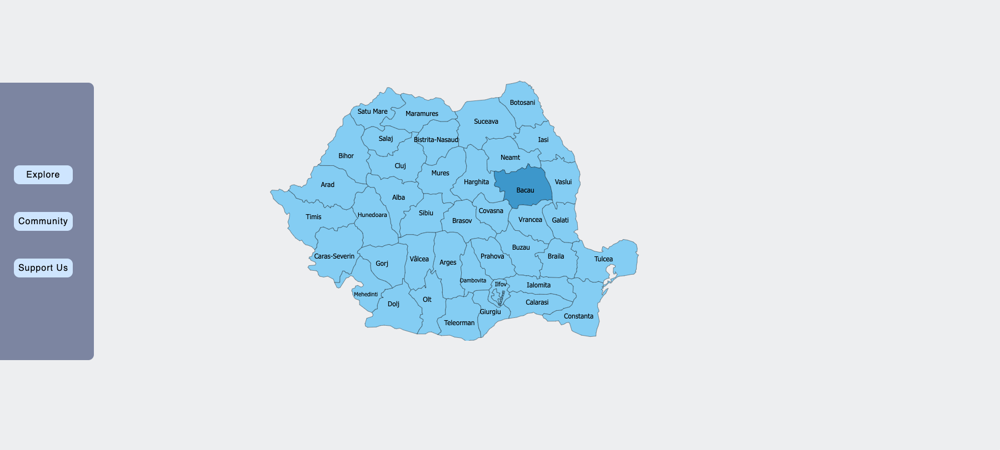
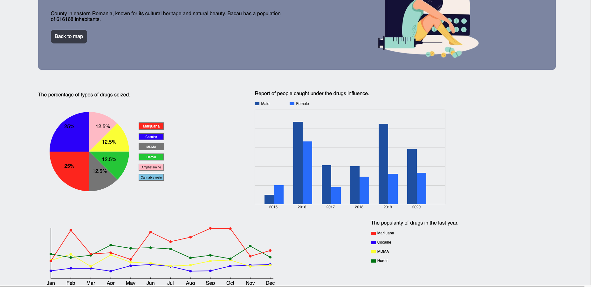
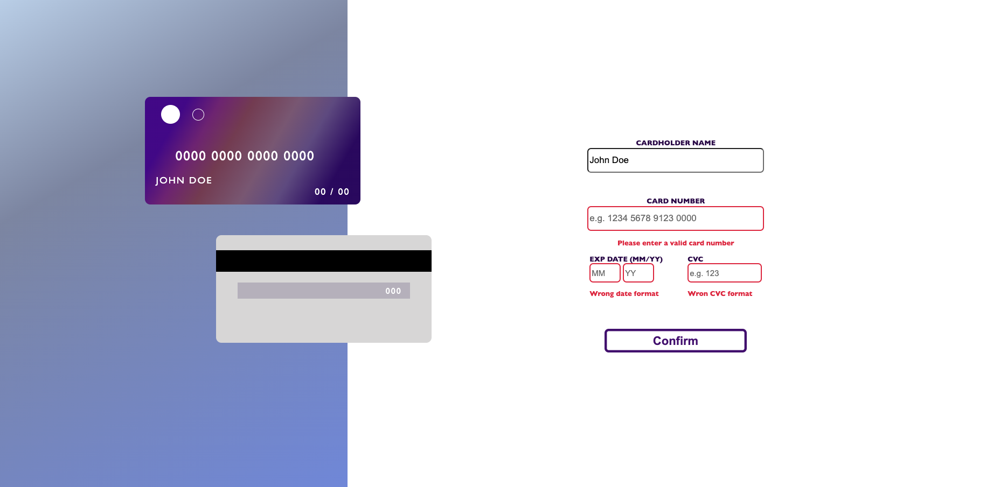
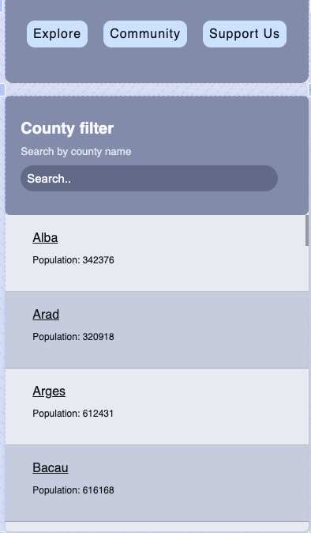

# RoDX-Romanian-Drug-Explorer

# Software Requirements Specification

## 1. Introduction

### 1.1 Purpose
The purpose of this document is to outline the requirements for the Drug Consumption Analysis Platform. It provides a detailed description of the software's functionality, constraints, and user interactions.

### 1.2 Scope
The software aims to provide an analytical and visualization tool for drug consumption in Romania over the past A years (minimum 3), in correlation with crimes and seizures. The platform focuses on frontend development, offering users a comprehensive exploration of the drug situation in Romania.

## 2. Overall Description

### 2.1 Product Perspective
The Drug Consumption Analysis Platform is a standalone web application developed to address the need for analyzing and visualizing drug-related data in Romania. It operates independently but may interact with external data sources for retrieving statistical information.

### 2.2 User Classes and Characteristics
The primary users of the platform include researchers, policymakers, and individuals interested in understanding drug trends and patterns in Romania. Users are expected to have basic computer literacy skills.

### 2.3 Operating Environment
The platform is designed to operate on modern web browsers, including Chrome, Firefox, and Safari, across various operating systems such as Windows, macOS, and Linux.

## 3. System Features

### 3.1 Landing Page
- Users can view a brief presentation of the community using visual-appealing features (slider, expanding cards).
- Login functionality allows access to the platform.

### 3.2 User Authentication
- Users can log in using a classic form with username, email, and password.
- User credentials are stored in localStorage.
- The authentication is made made to differentiate new users from the existing ones.

### 3.3 Interactive Map
- The map of Romania is created using SVG elements.
- Clicking on a county redirects the user to a page with detailed statistics.

### 3.4 Statistical Analysis
- Detailed statistics are represented by 3 charts.
- Data for each chart is generated custom using JavaScript.

### 3.5 County-specific Data
- Selecting a county displays charts with data based on year, month, and a brief description.

### 3.6 Payment Form
- Users can support the community by accessing a payment form.
- The payment form is integrated into the platform.

## 4. External Interface Requirements

### 4.1 User Interfaces
The platform offers intuitive user interfaces for navigation and interaction, including login forms, interactive maps, ui-pleasing features and chart visualizations.

### 4.2 Hardware Interfaces
The platform requires standard hardware components such as computers, tablets, or smartphones with internet connectivity.

### 4.3 Software Interfaces
The platform interacts with modern web browsers and may integrate external APIs for data retrieval.

## 5. Non-functional Requirements

### 5.1 Performance
- The system should respond to user interactions promptly.
- The platform should handle concurrent user requests efficiently.

### 5.2 Usability
- The user interface should be intuitive and easy to navigate.
- Error messages should be clear and informative.

### 6. System Models
#### 6.1. ## User Flow

### 1. Landing Page
- User visits the landing page.
- They are presented with an overview of the platform's features and a call-to-action to log in or sign up.
- 

### 2. Authentication
- User clicks on the login or sign up button.
- They are directed to the authentication page where they can enter their credentials or create a new account.
- 

### 3. Dashboard
- After successful authentication, the user is redirected to the dashboard.
- They can see a map of Romania and interact with it to view statistics for different regions.
- Users can also access additional features such as statistical analysis and support options.
- 

### 4. Statistical Analysis
- Users can select a specific region on the map to view detailed statistics.
- They can interact with charts and graphs to analyze drug consumption trends over time.
- 

### 5. Support
- Users can navigate to the support section to find information on how to donate or contribute to the platform.
- They can access a payment form to make donations if they wish.
- 
  
### 6. Mobile Experience
- The platform is responsive and provides a seamless experience on mobile devices.
- Users can access all features and functionalities on their smartphones or tablets.
- 

